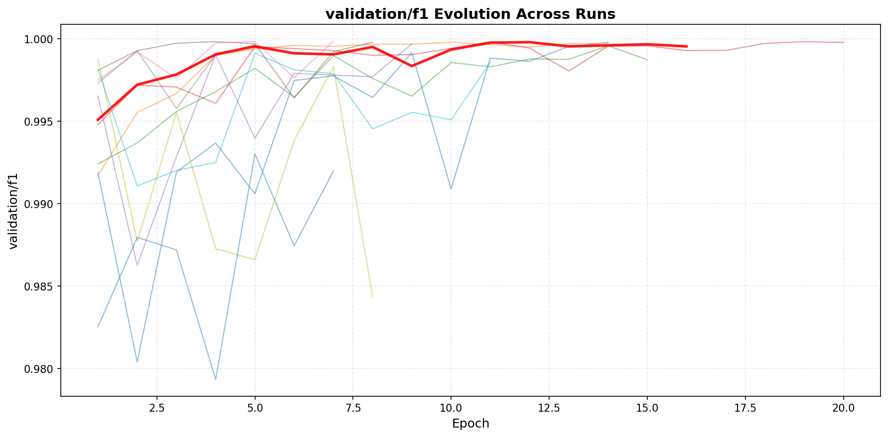
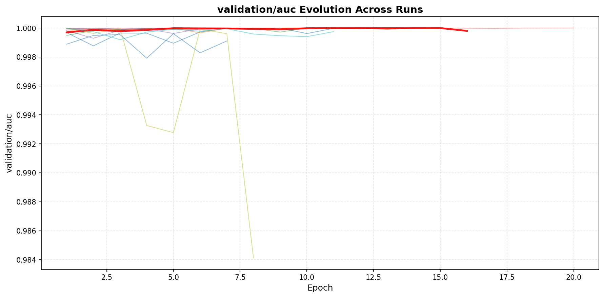
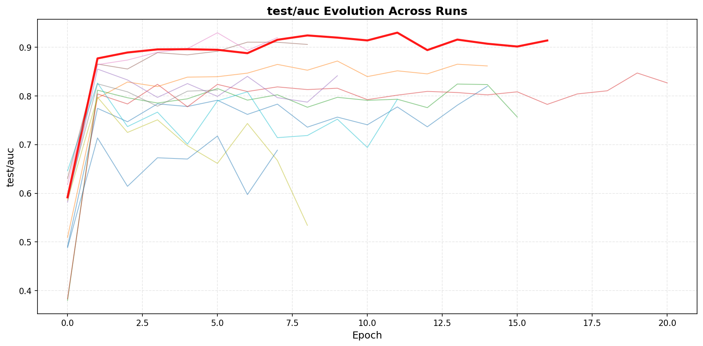
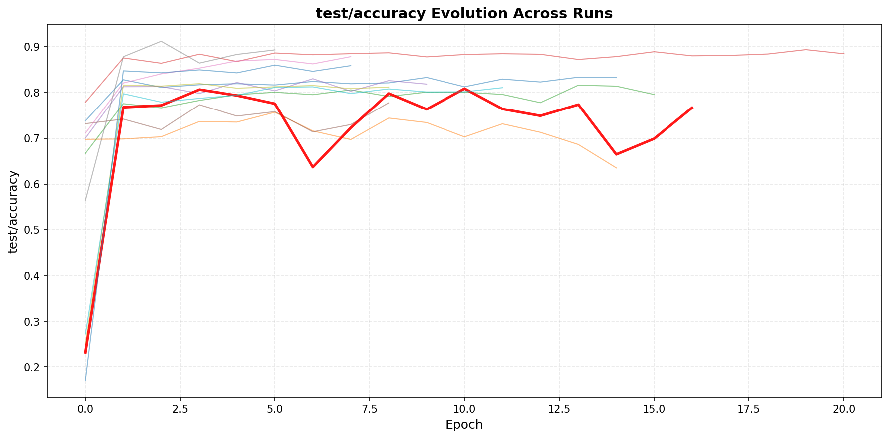
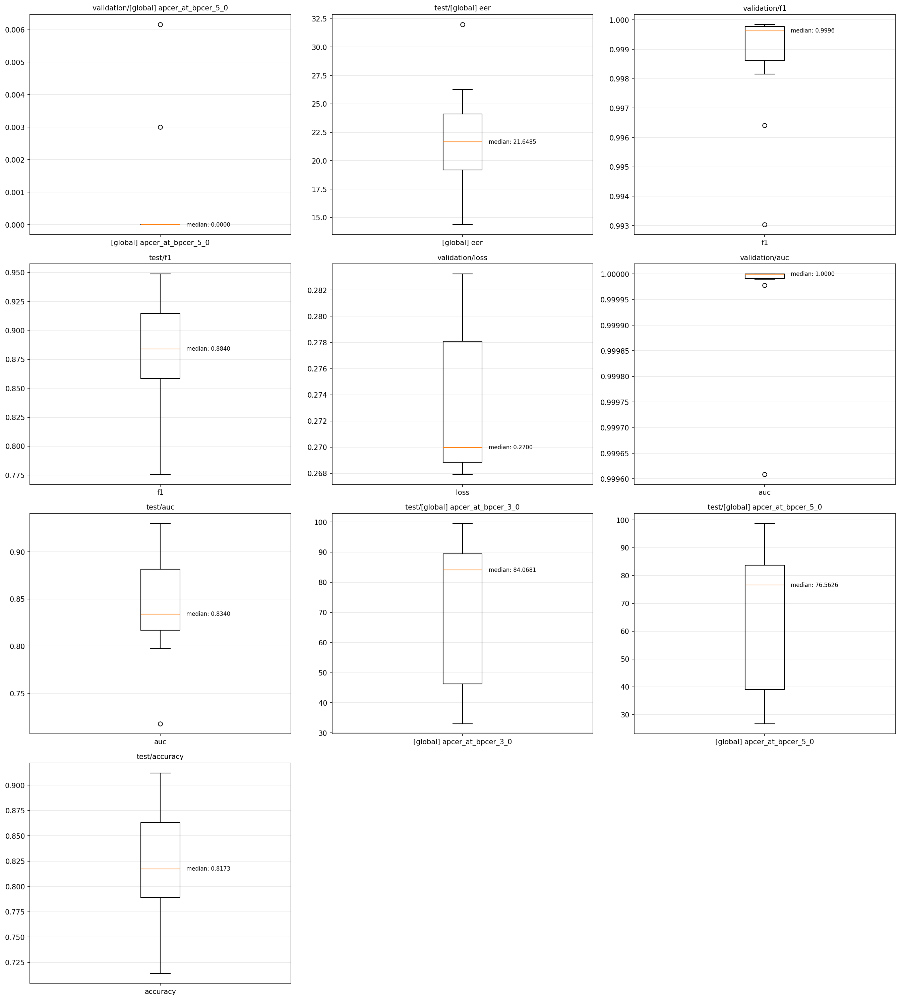

# Sweep Analysis Report

**Experiment**: fourier_filter_ocim

**User**: sushrut

**Sweep ID**: sweep_1763048246

**Generated**: 2025-11-14 10:34:44

---

## Summary

- **Total Runs**: 12
- **Completed**: 12
- **Failed**: 0
- **Success Rate**: 100.0%

# OCIM Results

| Backbone | Protocol (OCI -> M) | Protocol (ICM -> O) | Protocol (OIM -> C) | Protocol (OCM -> I) |
| -------- | ------------------- | ------------------- | ------------------- | ------------------- |
| resnet18 | (22.46%, 80.85%)    | (14.37%, 93.00%)    | (31.87%, 75.10%)    | (41.06%, 61.43%)    |
| resnet34 | (15.20%, 91.98%)    | (18.78%, 88.89%)    | (23.40%, 84.14%)    | (21.62%, 81.22%)    |
| resnet50 | (27.18%, 79.10%)    | (20.91%, 87.17%)    | (26.24%, 81.97%)    | (23.90%, 82.68%)    |

## Top Performers

### 1. backbone_resnet18_test_oulu_seed_2025

- **test/[global] eer**: 14.3650 (best epoch: 11)
- **test/[global] apcer_at_bpcer_1_0**: 44.7490
- **test/[global] apcer_at_bpcer_3_0**: 33.0300
- **test/[global] apcer_at_bpcer_5_0**: 26.6630
- **test/accuracy**: 0.7640
- **test/auc**: 0.9300
- **test/f1**: 0.8218
- **test/loss**: 0.5689
- **validation/[global] apcer_at_bpcer_1_0**: 0.0064
- **validation/[global] apcer_at_bpcer_3_0**: 0.0064
- **validation/[global] apcer_at_bpcer_5_0**: 0.0000
- **validation/[global] eer**: 0.0442
- **validation/accuracy**: 0.9997
- **validation/auc**: 1.0000
- **validation/f1**: 0.9998
- **validation/loss**: 0.2680
- **MLflow Run ID**: `bright_hand_g60nst2xg8`

### 2. backbone_resnet34_test_msu_seed_2025

- **test/[global] eer**: 14.8473 (best epoch: 5)
- **test/[global] apcer_at_bpcer_1_0**: 70.5399
- **test/[global] apcer_at_bpcer_3_0**: 39.7506
- **test/[global] apcer_at_bpcer_5_0**: 27.5381
- **test/accuracy**: 0.8724
- **test/auc**: 0.9298
- **test/f1**: 0.9126
- **test/loss**: 0.4494
- **validation/[global] apcer_at_bpcer_1_0**: 0.0000
- **validation/[global] apcer_at_bpcer_3_0**: 0.0000
- **validation/[global] apcer_at_bpcer_5_0**: 0.0000
- **validation/[global] eer**: 0.0232
- **validation/accuracy**: 0.9998
- **validation/auc**: 1.0000
- **validation/f1**: 0.9998
- **validation/loss**: 0.2679
- **MLflow Run ID**: `heroic_line_vwtdgh453w`

### 3. backbone_resnet34_test_oulu_seed_2025

- **test/[global] eer**: 16.0041 (best epoch: 6)
- **test/[global] apcer_at_bpcer_1_0**: 62.2180
- **test/[global] apcer_at_bpcer_3_0**: 41.5230
- **test/[global] apcer_at_bpcer_5_0**: 32.8790
- **test/accuracy**: 0.7141
- **test/auc**: 0.9105
- **test/f1**: 0.7758
- **test/loss**: 0.6940
- **validation/[global] apcer_at_bpcer_1_0**: 0.0000
- **validation/[global] apcer_at_bpcer_3_0**: 0.0000
- **validation/[global] apcer_at_bpcer_5_0**: 0.0000
- **validation/[global] eer**: 0.0442
- **validation/accuracy**: 0.9945
- **validation/auc**: 1.0000
- **validation/f1**: 0.9964
- **validation/loss**: 0.2819
- **MLflow Run ID**: `keen_calypso_zzdqjpcvqq`

### 4. backbone_resnet18_test_msu_seed_2025

- **test/[global] eer**: 20.2406 (best epoch: 1)
- **test/[global] apcer_at_bpcer_1_0**: 94.8797
- **test/[global] apcer_at_bpcer_3_0**: 88.3773
- **test/[global] apcer_at_bpcer_5_0**: 82.4589
- **test/accuracy**: 0.7974
- **test/auc**: 0.8265
- **test/f1**: 0.8707
- **test/loss**: 0.5768
- **validation/[global] apcer_at_bpcer_1_0**: 0.0246
- **validation/[global] apcer_at_bpcer_3_0**: 0.0062
- **validation/[global] apcer_at_bpcer_5_0**: 0.0062
- **validation/[global] eer**: 0.1486
- **validation/accuracy**: 0.9970
- **validation/auc**: 1.0000
- **validation/f1**: 0.9982
- **validation/loss**: 0.2780
- **MLflow Run ID**: `amusing_yuca_vd7h7vlqpy`

### 5. backbone_resnet50_test_oulu_seed_2025

- **test/[global] eer**: 20.9132 (best epoch: 9)
- **test/[global] apcer_at_bpcer_1_0**: 60.3770
- **test/[global] apcer_at_bpcer_3_0**: 47.9240
- **test/[global] apcer_at_bpcer_5_0**: 40.9450
- **test/accuracy**: 0.7343
- **test/auc**: 0.8717
- **test/f1**: 0.7991
- **test/loss**: 0.6100
- **validation/[global] apcer_at_bpcer_1_0**: 0.0000
- **validation/[global] apcer_at_bpcer_3_0**: 0.0000
- **validation/[global] apcer_at_bpcer_5_0**: 0.0000
- **validation/[global] eer**: 0.0237
- **validation/accuracy**: 0.9995
- **validation/auc**: 1.0000
- **validation/f1**: 0.9997
- **validation/loss**: 0.2708
- **MLflow Run ID**: `nifty_sheep_ff1d9wtqtp`

## Metric Statistics

| Metric | Mean ?? Std | Min | Max |
|--------|-----------|-----|-----|
| test/[global] apcer_at_bpcer_1_0 | 82.6832 ?? 18.3991 | 44.7490 | 99.9300 |
| test/[global] apcer_at_bpcer_3_0 | 72.4122 ?? 24.6134 | 33.0300 | 99.4833 |
| test/[global] apcer_at_bpcer_5_0 | 66.0680 ?? 26.8095 | 26.6630 | 98.7133 |
| test/[global] eer | 21.6486 ?? 5.1046 | 14.3650 | 31.9950 |
| test/accuracy | 0.8191 ?? 0.0608 | 0.7141 | 0.9119 |
| test/auc | 0.8436 ?? 0.0608 | 0.7176 | 0.9300 |
| test/f1 | 0.8780 ?? 0.0541 | 0.7758 | 0.9486 |
| test/loss | 0.5405 ?? 0.0780 | 0.4180 | 0.6940 |
| validation/[global] apcer_at_bpcer_1_0 | 0.0042 ?? 0.0077 | 0.0000 | 0.0246 |
| validation/[global] apcer_at_bpcer_3_0 | 0.0022 ?? 0.0037 | 0.0000 | 0.0109 |
| validation/[global] apcer_at_bpcer_5_0 | 0.0008 ?? 0.0019 | 0.0000 | 0.0062 |
| validation/[global] eer | 0.0712 ?? 0.1094 | 0.0000 | 0.3885 |
| validation/accuracy | 0.9979 ?? 0.0032 | 0.9890 | 0.9998 |
| validation/auc | 1.0000 ?? 0.0001 | 0.9996 | 1.0000 |
| validation/f1 | 0.9987 ?? 0.0020 | 0.9930 | 0.9998 |
| validation/loss | 0.2729 ?? 0.0058 | 0.2679 | 0.2832 |

## Visualizations

### Metric Evolution

![validation/[global] apcer_at_bpcer_5_0](plots/metric_evolution_validation_[global] apcer_at_bpcer_5_0.png)

![test/[global] eer](plots/metric_evolution_test_[global] eer.png)

![test/[global] apcer_at_bpcer_3_0](plots/metric_evolution_test_[global] apcer_at_bpcer_3_0.png)

![test/[global] apcer_at_bpcer_5_0](plots/metric_evolution_test_[global] apcer_at_bpcer_5_0.png)

### Metric Distributions

### Best Epochs

